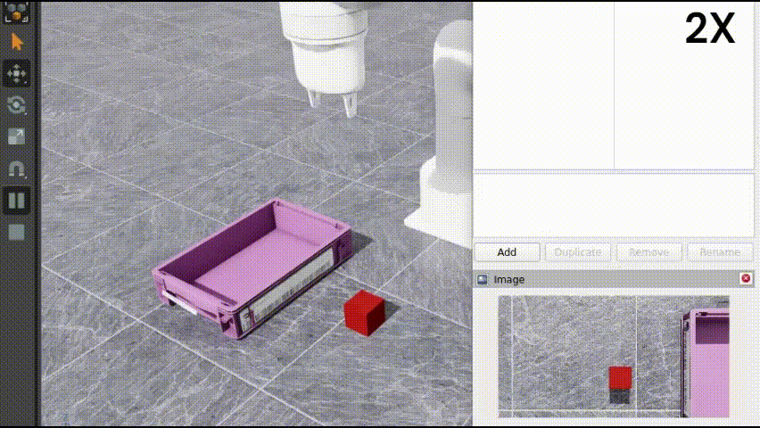

# Pick and Place Imitation Learning with Isaac Sim & ROS2

This project implements a pick-and-place task using imitation learning. This is accomplished solely through simulation, without expensive hardware. The simulator uses NVIDIA Isaac Sim and requires ROS2 integration.

## Demo Video



## Technologies Used

- Isaac Sim
- ROS2
- Python
- Imitation Learning
## What This Repository Enables
- Collect demonstrations in simulated environments
- Train and evaluate a Diffusion Policy mode
- Support the Lite 6 robot arm

## Setup Instructions
### Docker Installation
You need to have Docker installed. If you have an NVIDIA GPU, follow [this guide](https://docs.nvidia.com/datacenter/cloud-native/container-toolkit/latest/install-guide.html) for GPU support.  
Isaac Sim must also be installed if you plan to use simulation.

```
sudo apt install git make curl
curl -sSL https://get.docker.com | sh && sudo usermod -aG docker $USER
```
### Clone and Build
```
git clone https://github.com/uiseoklee/Pick-Place_Imitation-Learning-Isaac-sim-ROS2.git
cd Pick-Place_Imitation-Learning-Isaac-sim-ROS2/docker
make build-pc run exec
```
### Build ROS2 Packages
```
colcon build --symlink-install
source ./install/local_setup.bash
```
## Running Simulation
### Launch ROS2 Controller
```
ros2 launch xarm_bringup lite6_cartesian_launch.py rviz:=false sim:=true
```
### Run Simulator in Docker
Open another terminal and run Isaac Sim(v4.2.0)

**NOTE:** Isaac Sim needs to be run with Docker to communicate with the source code.

And load environments(lite6_wCamera_w1Block_wBasket.usda)
### Inferencing trained Model in Docker
Open another terminal and run:
```
make exec
cd src/robo_imitate
./imitation/pickplace_redblock
```
### Newly Model Training
**NOTE:** First, you need to collect the expert dataset following [this procedure](https://github.com/uiseoklee/Pick-Place_Imitation-Learning-Isaac-sim-ROS2/tree/main/xarm_bringup/scripts) inside the docker directory.
Then, go outside the docker directory and run the following in the Pick-Place_Imitation-Learning-Isaac-sim-ROS2 directory.
```
docker build --build-arg UID=$(id -u) -t imitation .
docker run -v $(pwd)/imitation/:/docker/app/imitation:Z --gpus all -it \
  -e DATA_PATH=imitation/data/sim_imitation_training_data.parquet \
  -e EPOCH=1000 imitation
```
## Acknowledgments
This repository is based on MarijaGolubovic/robo_imitate.
Special thanks to:
- Marija Golubovic
- @SpesRobotics.
- LeRobot team for open-sourcing LeRobot projects
- Cheng Chi, Zhenjia Xu, and colleagues for open-sourcing Diffusion Policy
