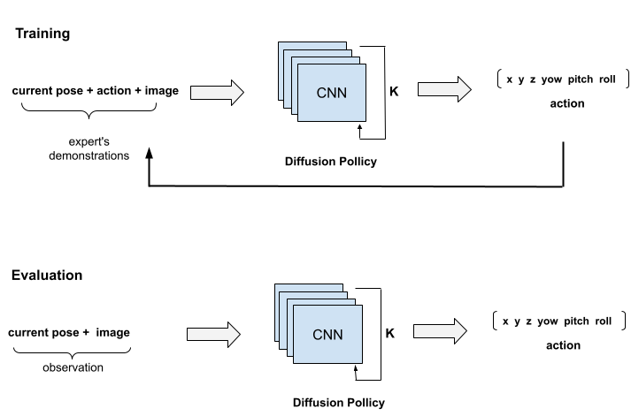

# Imitation Learning
Inside this folder, you can find scripts for simple Diffusion model training and evaluation.
<div align='center'>
    
</div>

</br>

 During model training, we provide the model with images, the current pose, and actions performed by an expert during evaluation. The input data is normalized before being used for learning behavior. In the end, the model learns to generate actions similar to those of the expert by using the images and the current state obtained from observations.

## Model training
Once you have collected the demonstrations, you can start training the model. If you modify the data format, you can configure the model in the script [config.py](imitation/common/config.py).  In this config file, you can also adjust additional parameters for the model. For more details, refer to the Diffusion Policy [paper](https://diffusion-policy.cs.columbia.edu/).

>[!IMPORTANT]
Before starting the training, you need to move the parquet file into the imitation/data folder and update the data file name in the command accordingly.

There are two ways to train the model:
- Running an independent Docker container that executes all necessary scripts and outputs the model weights.

Inside `robo_imitate` directory run follow commands:

```sh 
docker build --build-arg UID=$(id -u) -t imitation .
```

```sh
docker run -v $(pwd)/imitation/:/docker/app/imitation:Z --gpus all -it -e DATA_PATH=imitation/data/sim_imitation_training_data.parquet -e EPOCH=1000 imitation
```

- Running the training scripts inside the same Docker container where you execute the robot arm controller.
Run this command inside the folder `src/robo_imitate`:

```sh
python3 ./imitation/compute_stats --path imitation/data/sim_imitation_training_data.parquet  && python3 ./imitation/train_script --path imitation/data/sim_imitation_training_data.parquet  --epoch 1000
```

## Model training
Inside docker container run:
- Run ROS 2 controler
```sh
ros2 launch xarm_bringup lite6_cartesian_launch.py rviz:=false sim:=true
```
If you want to vizualize robot set `rviz` on true. If you want to use real enviroment set `sim` on false.

- Open another terminal and run docker
```sh
make exec
```

- Run model inside docker
```sh
 cd src/robo_imitate && ./imitation/pickplace_redblock
```
